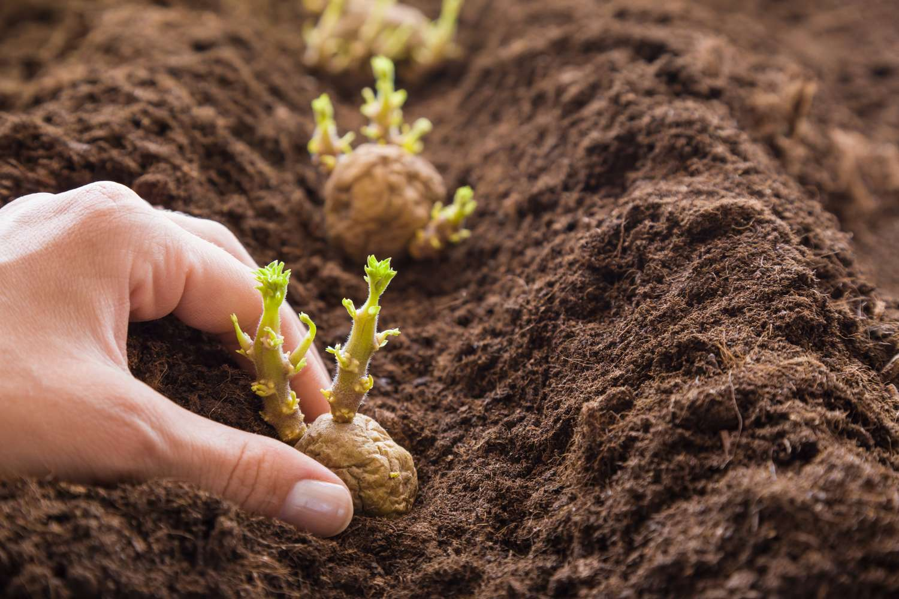

# Let's plant some potatoes

It's an **educational project** that show people how might the simplest DI container work

So-called **@Bean**'s are substituted with **@Potato**'s

It's based on the assumption that for _potato_ creation No-args constructor is presented and _potato-injection_ is done
by direct field injection

Just FYI: field injection is an anti-pattern, everything is done just for educational sake

You can find an example of usage in **tests** folder
